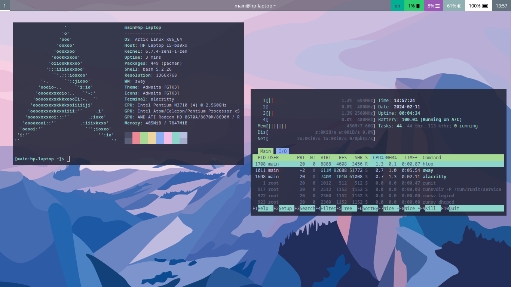
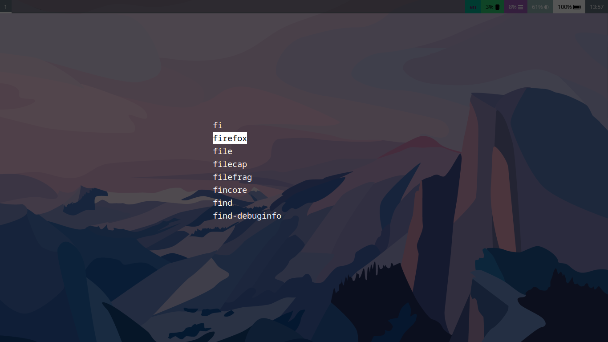
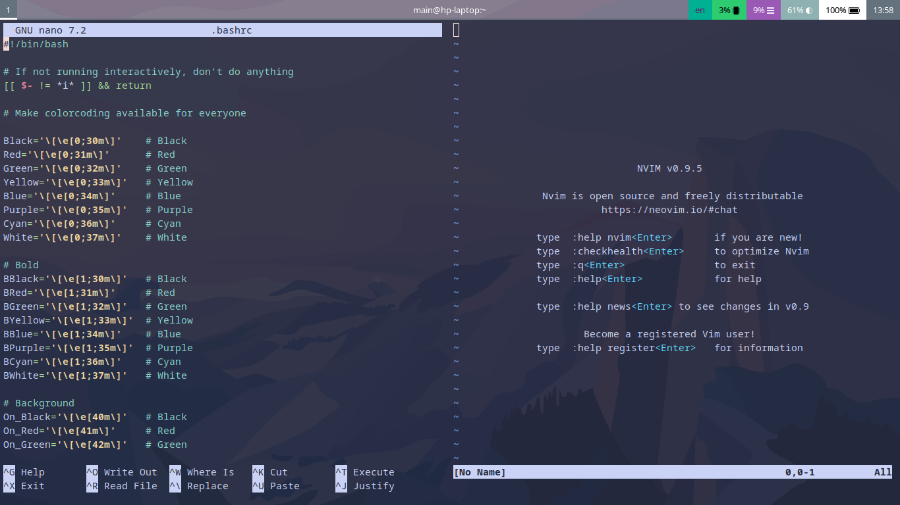

# My dotfiles





## Summary
- **Shell**: 
- **Terminal emulator**: [Alacritty](https://github.com/alacritty/alacritty)
- **Editor**: [Neovim](https://neovim.io/)
- **Window Manager**: [Sway](https://swaywm.org/)
- **Bar**: [waybar](https://github.com/Alexays/Waybar)
- **Launcher**: [tofi](https://github.com/philj56/tofi)

## Setting Up
### Installing required packages
- On Arch linux:
  ```bash
  sudo pacman -S nano nvim sway waybar swaybg
  ```

### Building from source
- [tofi](https://github.com/philj56/tofi):
  ```
  sudo pacman -S freetype2 harfbuzz cairo pango wayland libxkbcommon
  sudo pacman -S meson scdoc wayland-protocols
  git clone --depth 1 https://github.com/philj56/tofi
  cd tofi
  meson build -Dbuildtype=release && ninja -C build install
  cd ../
  ```

## TODO
- Power menu
- Refine waybar config
- Setup audio
- Update nvim config
- Rice firefox
- List all of the required packages

